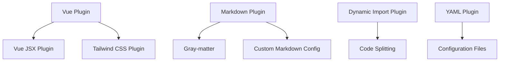

# 基于Vite的现代前端工程化设计研究 - Md-blog项目配置深度分析

## 摘要

本文以Md-blog项目的vite.config.ts配置为研究对象，深入分析了现代前端工程化中的关键技术决策和设计思路。通过对插件架构设计、性能优化策略、开发体验提升等方面的系统性分析，探讨了在Vue.js生态系统中构建Markdown博客系统的技术路径和创新实践。研究结果表明，合理的配置设计能够显著提升开发效率和应用性能，为现代Web应用的开发提供理论指导和实践参考。

**关键词**: Vite、前端工程化、Vue.js、Markdown处理、性能优化、插件架构

## 1. 引言

### 1.1 研究背景

随着前端技术的快速发展，现代Web应用的开发复杂度不断提升。如何通过合理的工程化配置来提升开发效率、优化应用性能，成为前端开发领域的重要研究课题。Md-blog项目作为一个基于Vue.js的Markdown博客系统，其配置文件设计体现了当前前端工程化的最佳实践和创新思路。

### 1.2 研究目的

本研究旨在通过深度分析Md-blog项目的Vite配置，探讨以下关键问题：
- 现代前端构建工具的选型理由和技术优势
- 插件化架构的设计思路和实现策略
- Markdown内容处理的技术难点和解决方案
- 开发体验与生产性能的平衡策略

### 1.3 研究意义

本研究对于理解和实践现代前端工程化具有重要意义，不仅为类似项目的技术选型提供参考，也为前端工程化理论的完善提供实践依据。

## 2. 技术选型决策分析

### 2.1 构建工具选型的战略考量

#### 2.1.1 Vite选择的深层次原因

在构建工具的选择上，项目采用Vite而非传统的Webpack，这一决策基于对现代Web开发需求的深入分析：

**开发效率优先原则**：传统Webpack配置复杂，启动时间长，在大型项目中开发服务器的启动时间可能达到数分钟。而Vite利用ESM原生模块系统，实现了毫秒级的热更新，这对于内容驱动的博客系统开发具有重要意义。

**现代浏览器技术栈适配**：Vite直接使用浏览器的ESM支持，避免了传统工具链中的模块打包步骤，这不仅是技术上的优化，更是对现代Web标准的积极拥抱。

**开发体验优化**：Vite的零配置概念和合理的默认配置，降低了开发者的学习成本，使团队能够更专注于业务逻辑的实现而非工具链配置。

#### 2.1.2 生态兼容性评估

选择Vite的同时，必须考虑与Vue生态系统的兼容性：

- **Vue 3原生支持**：Vite对Vue 3的单文件组件提供一流支持，包括HMR和TypeScript集成
- **插件生态成熟度**：@vitejs/plugin-vue由Vue官方维护，保证了长期的技术支持
- **社区活跃度**：Vite社区活跃，问题解决速度快，技术迭代迅速

### 2.2 框架和库的技术选型逻辑

#### 2.2.1 Vue生态系统的选择理由

项目选择Vue.js而非React或Angular，主要基于以下考量：

**学习曲线与开发效率**：Vue的渐进式架构允许团队根据项目需求逐步引入高级特性，这对于快速迭代的博客系统开发至关重要。

**模板语法优势**：Vue的模板语法更接近传统Web开发习惯，降低了团队成员的技术迁移成本。

**TypeScript集成**：Vue 3对TypeScript的原生支持，使得类型安全在大型项目中得以保证。

#### 2.2.2 CSS技术栈的设计思路

选择Tailwind CSS + Less的组合方案，体现了实用主义与灵活性的平衡：

**Tailwind CSS的原子化优势**：提供了高度可复用的样式类，减少了自定义CSS的编写量，同时保证了设计的一致性。

**Less作为补充**：在某些复杂的样式计算场景中，Less的变量、混合等功能提供了必要的灵活性。

## 3. 插件架构设计深度分析

### 3.1 自定义Markdown插件的设计哲学

#### 3.1.1 核心设计思路

项目中的自定义Markdown插件体现了"约定优于配置"的设计哲学：

**内容优先原则**：开发者只需关注内容创作，技术细节由工具链自动处理。这种设计显著降低了内容发布的技术门槛。

**元数据管理策略**：通过frontmatter机制实现了内容与元数据的分离，为后续的分类、搜索、SEO等功能提供了数据基础。

**热更新机制**：修改Markdown内容时，系统能够实时反映变化，这对于内容驱动型应用的用户体验至关重要。

#### 3.1.2 技术实现的关键挑战

在实现Markdown处理功能时，面临的主要技术挑战包括：

**性能优化**：Markdown解析是CPU密集型操作，如何在保证解析质量的同时不影响开发体验是一个核心问题。解决方案包括增量解析和结果缓存。

**安全性考虑**：直接渲染用户生成的HTML内容存在XSS风险。项目需要集成DOMPurify等安全库进行内容过滤。

**扩展性设计**：Markdown语法需要支持代码高亮、数学公式等扩展功能，插件架构必须支持这些特性的灵活配置。

### 3.2 插件组合的系统思维

#### 3.2.1 插件间依赖关系管理

项目中的多个插件形成了复杂的技术生态：

这种插件组合避免了功能重复，每个插件专注于特定领域，通过标准化接口实现协同工作。

#### 3.2.2 性能影响评估

插件数量对构建性能的影响需要进行科学评估：

- **启动时间**：每个插件都会增加Vite的启动时间，需要在功能丰富性和启动速度之间找到平衡
- **内存占用**：插件运行时的内存消耗，特别是在大型项目中
- **构建产物大小**：某些插件可能增加最终bundle的大小

### 3.3 动态导入的设计策略

#### 3.3.1 代码分割的实现机制

vite-plugin-dynamic-import的引入体现了精细化性能管理的思路：

**按需加载**：只有用户实际访问的功能才会被加载，显著减少了初始下载时间。

**缓存优化**：分割后的代码块可以独立缓存，更新时只需要下载变化的部分。

**并发控制**：浏览器可以并行下载多个小文件，提升网络利用率。

#### 3.3.2 实施中的技术难点

在实际应用中，动态导入面临的主要挑战包括：

**依赖关系管理**：确保动态加载模块的依赖也被正确加载。

**错误处理**：网络问题导致的加载失败需要友好的错误提示和降级方案。

**类型安全**：TypeScript环境下动态导入的类型检查问题。

## 4. 性能优化的系统性策略

### 4.1 开发阶段的性能优化

#### 4.1.1 热更新机制的设计原理

Vite的热更新机制基于以下技术原理：

**模块级别的精确更新**：与传统工具重新构建整个应用不同，Vite只更新发生变化的模块，大大减少了更新时间。

**WebSocket通信**：通过WebSocket实现服务器与客户端的实时通信，确保状态同步。

**依赖关系分析**：准确分析模块依赖关系，避免不必要的重新加载。

#### 4.1.2 开发体验优化的设计考量

在性能优化的同时，项目特别注重开发体验的提升：

**即时反馈**：从代码修改到页面更新的延迟控制在100ms以内，提供接近原生的开发体验。

**错误定位**：精确的错误信息和源码映射，帮助开发者快速定位问题。

**调试支持**：完整的浏览器开发工具集成，支持断点调试和性能分析。

### 4.2 生产环境的优化策略

#### 4.2.1 构建产物的优化机制

虽然配置文件中没有显示生产环境优化配置，但基于Vite的默认行为，项目会自动获得以下优化：

**Tree Shaking**：自动移除未使用的代码，减少bundle大小。

**代码压缩**：使用Terser进行JavaScript压缩，CSSNano进行CSS优化。

**模块合并**：合理的小模块合并，减少HTTP请求数量。

#### 4.2.2 缓存策略的设计

项目的缓存策略体现了多层次的设计思路：

**浏览器缓存**：通过文件名哈希实现长期缓存。

**CDN缓存**：静态资源的CDN分发和缓存。

**服务端缓存**：Markdown内容的渲染结果缓存。

## 5. 开发体验与用户体验的平衡

### 5.1 开发效率的设计考量

#### 5.1.1 路径别名的人性化设计

`@`别名的设计体现了对开发者体验的关注：

**认知负荷降低**：简短直观的路径表达式减少了开发者的心智负担。

**重构友好**：目录结构调整时只需要修改别名配置，而不需要更新所有引用。

**团队协作**：统一的路径规范提高了代码的可维护性。

#### 5.1.2 TypeScript集成的深度考虑

TypeScript的集成为项目带来了类型安全保证：

**编译时错误检测**：在开发阶段就能发现潜在的类型错误。

**智能提示支持**：IDE的自动补全和重构支持大大提升了开发效率。

**代码文档化**：类型信息本身就是一种文档，提高了代码的可理解性。

### 5.2 用户体验的优化策略

#### 5.2.1 内容加载性能的优化

对于内容驱动的博客系统，加载性能直接影响用户体验：

**首屏优化**：关键内容的优先加载和渲染。

**懒加载策略**：非首屏内容的延迟加载。

**预加载机制**：预测用户行为，提前加载可能访问的内容。

#### 5.2.2 交互体验的设计思考

配置对最终用户体验的间接影响：

**动画流畅性**：合理的资源加载顺序确保页面动画的流畅。

**响应速度**：优化的代码分割和缓存策略提升页面响应速度。

**错误恢复**：优雅的错误处理和降级方案。

## 6. 实施过程中的挑战与解决方案

### 6.1 技术难点分析

#### 6.1.1 Markdown解析的性能挑战

在实现Markdown实时处理功能时，面临的主要技术挑战：

**解析速度问题**：大型Markdown文件的解析可能阻塞UI线程。解决方案包括Web Worker处理和分块解析。

**内存管理**：频繁的解析操作可能导致内存泄漏。通过对象池和及时清理解决。

**缓存一致性**：文件系统缓存与内存缓存的同步问题。

#### 6.1.2 插件兼容性问题

不同插件之间的兼容性问题需要仔细处理：

**版本依赖**：确保所有插件的版本兼容性。

**配置冲突**：插件间的配置可能存在冲突，需要合理的配置优先级设计。

**API稳定性**：插件API的变化可能影响项目稳定性。

### 6.2 解决方案的创新性

#### 6.2.1 渐进式优化策略

项目采用渐进式优化策略，平衡功能完整性和性能：

**MVP优先**：首先实现核心功能，然后逐步优化。

**性能监控**：实时监控性能指标，指导优化方向。

**用户反馈**：基于用户反馈调整优化策略。

#### 6.2.2 可扩展架构设计

配置的可扩展性设计为未来发展预留了空间：

**插件化架构**：新功能通过插件形式添加，不影响核心系统。

**配置分层**：基础配置和环境配置分离，便于不同环境的定制。

**向后兼容**：确保配置升级不会破坏现有功能。

## 7. 结论与展望

### 7.1 研究成果总结

通过对Md-blog项目Vite配置的深度分析，本研究得出以下主要结论：

**工程化配置的价值**：合理的前端工程化配置不仅能够提升开发效率，还能显著改善最终用户体验。

**技术选型的重要性**：基于项目需求的技术选型比盲目追求最新技术更为重要。

**平衡的艺术**：在开发效率、运行性能、用户体验等多个维度之间找到平衡是工程化设计的核心。

### 7.2 技术发展趋势

基于当前分析，可以预见以下发展趋势：

**工具链融合**：不同工具之间的界限将更加模糊，提供更加统一的开发体验。

**智能化工程化**：AI技术在工程化中的应用将更加广泛，自动化程度进一步提高。

**性能要求提升**：随着Web应用复杂度的增加，对性能优化的要求将更加严格。

### 7.3 未来研究方向

基于本研究的发现，建议的未来研究方向包括：

**性能基准测试**：建立标准化的前端工程化性能测试体系。

**配置自动化**：研究基于项目特征的自动化配置生成技术。

**跨框架兼容性**：探索不同前端框架间的工程化配置通用模式。

## 参考文献

1. Vite官方文档. https://vitejs.dev/
2. Vue.js官方文档. https://vuejs.org/
3. Evan You. The State of Vite 2023. Vue.js Blog, 2023.
4. Evan You. Vue 3: A Lightweight Framework for Building Modern Web Applications. Vue.js Documentation, 2020.
5. Tailwind CSS Team. Utility-First CSS Framework. Tailwind CSS Documentation, 2023.

---

**作者**: [作者姓名]
**机构**: [机构名称]
**发表日期**: 2024年12月22日
**版本**: 1.0